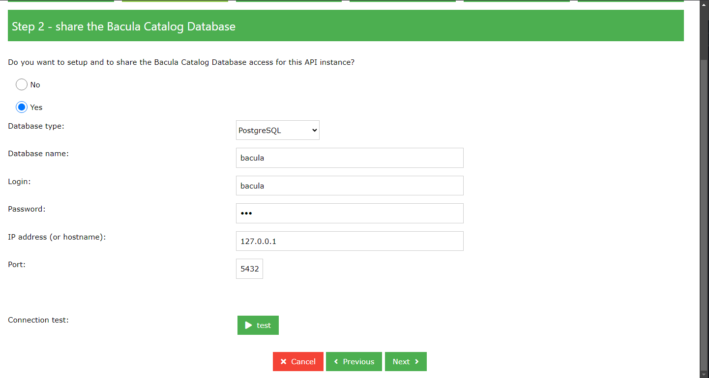
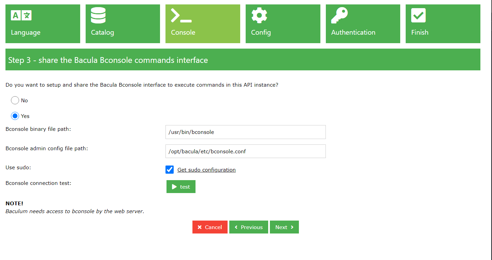
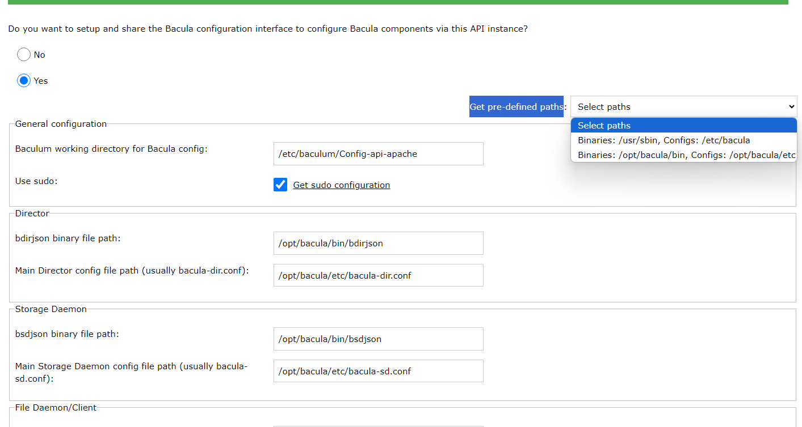
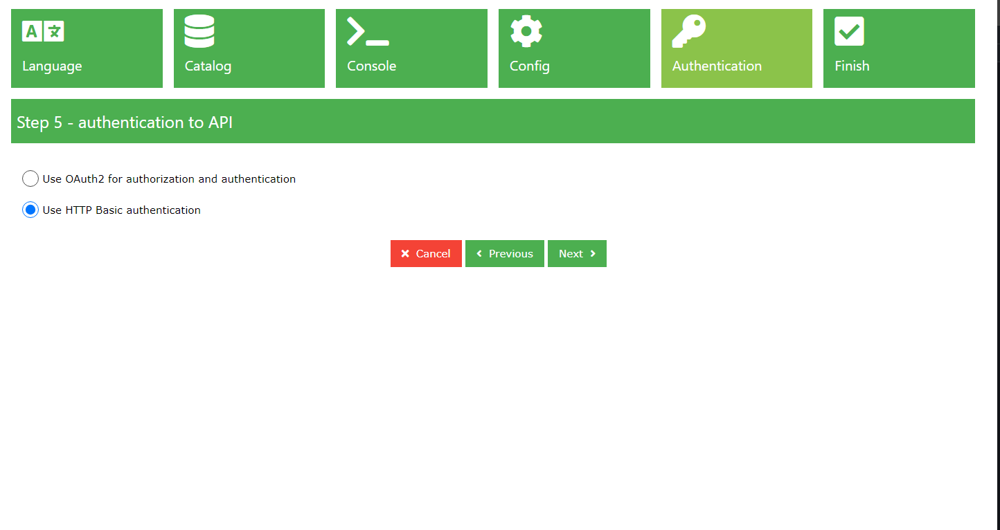
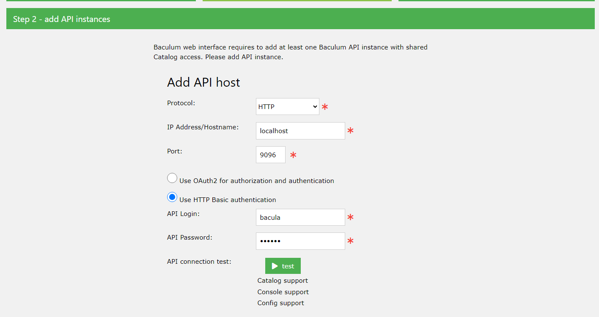

## Repositorios Debian

nano /etc/apt/sources.list

--------------

deb https://deb.debian.org/debian/ bullseye main
deb-src https://deb.debian.org/debian/ bullseye main

deb https://security.debian.org/debian-security bullseye-security main contrib
deb-src https://security.debian.org/debian-security bullseye-security main contrib

deb https://deb.debian.org/debian/ bullseye-updates main contrib
deb-src https://deb.debian.org/debian/ bullseye-updates main contrib

-----------

apt update && apt upgrade -y

# Instalacion de Bacula en Debian 11

* Enviar los archivos del debian a la maquina.

  
-  curl -o bacula-client_11.0.6-22062908~bullseye_amd64.deb http://10.156.106.204/bacula-client_11.0.6-22062908~bullseye_amd64.deb

-  curl -o bacula-postgresql_11.0.6-22062908~bullseye_amd64.deb http://10.156.106.204/bacula-postgresql_11.0.6-22062908~bullseye_amd64.deb

-  curl -o bacula-console_11.0.6-22062908~bullseye_amd64.deb http://10.156.106.204/bacula-console_11.0.6-22062908~bullseye_amd64.deb

-  curl -o bacula-common_11.0.6-22062908~bullseye_amd64.deb http://10.156.106.204/bacula-common_11.0.6-22062908~bullseye_amd64.deb

Instalas los archivos en orden. 

-  dpkg -i bacula-common_11.0.6-22062908~bullseye_amd64.deb

-  dpkg -i bacula-console_11.0.6-22062908~bullseye_amd64.deb

-  apt -f install -y

-  dpkg -i bacula-client_11.0.6-22062908~bullseye_amd64.deb

-  apt -y install dbconfig-common dbconfig-pgsql postgresql-contrib mtx mt-st

-  dpkg -i bacula-postgresql_11.0.6-22062908~bullseye_amd64.deb

-Con eso ya esta bacula instalado y funcionando-

# Intalacion de Baculum

-  apt install -y gnupg gnupg2 gnupg1

-  wget -qO - http://www.bacula.org/downloads/baculum/baculum.pub | apt-key add -

cat << EOF >> /etc/apt/sources.list.d/baculum.list
deb http://www.bacula.org/downloads/baculum/stable-11/debian bullseye main
deb-src http://www.bacula.org/downloads/baculum/stable-11/debian bullseye main
EOF

-  apt update && apt upgrade -y

-  apt-get -y install baculum-common baculum-api baculum-api-apache2 baculum-web baculum-web-apache2

-  a2enmod rewrite

-  a2ensite baculum-api

-  a2ensite baculum-web

-  systemctl restart apache2

-Crear Link simbolicos-

-  ln -s /opt/bacula/bin/* /usr/bin/

-  systemctl status bacula-dir.service bacula-fd.service bacula-sd.service

-  systemctl restart bacula-dir.service bacula-fd.service bacula-sd.service

cat << EOF > /etc/sudoers.d/baculum-api
Defaults:www-data !requiretty
www-data ALL = (root) NOPASSWD: /opt/bacula/bin/bconsole
www-data ALL = (root) NOPASSWD: /opt/bacula/bin/bdirjson
www-data ALL = (root) NOPASSWD: /opt/bacula/bin/bsdjson
www-data ALL = (root) NOPASSWD: /opt/bacula/bin/bfdjson
www-data ALL = (root) NOPASSWD: /opt/bacula/bin/bbconsjson
www-data ALL = (root) NOPASSWD: /usr/bin/systemctl start bacula-dir
www-data ALL = (root) NOPASSWD: /usr/bin/systemctl stop bacula-dir
www-data ALL = (root) NOPASSWD: /usr/bin/systemctl restart bacula-dir
www-data ALL = (root) NOPASSWD: /usr/bin/systemctl start bacula-sd
www-data ALL = (root) NOPASSWD: /usr/bin/systemctl stop bacula-sd
www-data ALL = (root) NOPASSWD: /usr/bin/systemctl restart bacula-sd
www-data ALL = (root) NOPASSWD: /usr/bin/systemctl start bacula-fd
www-data ALL = (root) NOPASSWD: /usr/bin/systemctl stop bacula-fd
www-data ALL = (root) NOPASSWD: /usr/bin/systemctl restart bacula-fd
EOF

-  chown bacula:www-data /opt/bacula/etc -R

-  chmod g+w /opt/bacula/etc -R

-  chown root:bacula /opt/bacula/

-  chmod g+w /opt/bacula/

Cambia las password de los achivos en la siguiente ruta

-  cd /opt/bacula/etc

-ls 

- nano Nombrearchivo

-  systemctl restart bacula-dir.service bacula-fd.service bacula-sd.service

-----Con esto ya tienes bacula y baculum operativo-----

## Configuracion Baculum

NOTA: Para configurar baculum hay que comenzar por la del puerto 9096 y luego la del 9095

# *Pagina de admin 

Ahora en un Navegador buscar `Tuip`:9096  

Nota: el primer inicio es admin admin

-----Llenas el formulario.-----

-----buscas los path de Bconsole con el comnado `where is`-----

-----Primero seleccionas YES y en el campo " Get pre-defined paths: " seleccionas el segundo, esto hace que se llenen los campos automaticamente menos el primero Este se llena con  este path " /etc/baculum/Config-api-apache " -----

----- Aqui siguiente y en el siguiente menu le das save -----

# *Pagina de operador

----- Despues guardas y ya tienes bacula y baculum configurado en tu maquina debian -----

## EN CASO DE TENER UNA INSTALACION FALLIDA O ERRORES
Para volver a comenzar la instalacion 

dpkg -l | grep bacula | awk '{print $2}' | xargs apt -y remove --purge

dpkg -l | grep postgresql | awk '{print $2}' | xargs apt -y remove --purge

apt remove --purge bacula-postgresql postgresql-13 postgresql-15 postgresql-client-13 postgresql-client-15 postgresql-client-common postgresql-common postgresql-contrib -y

dpkg -l | grep bacula

dpkg -l | grep postgresql

apt --fix-broken install

apt install -y dbconfig-pgsql postgresql-contrib

apt install cifs-utils -y

mount -t cifs -o username=jgomeza,password=OAUypksG //10.156.106.204/c$/Users/jgomeza/Downloads/Telegram Desktop/bacula /storage-device

